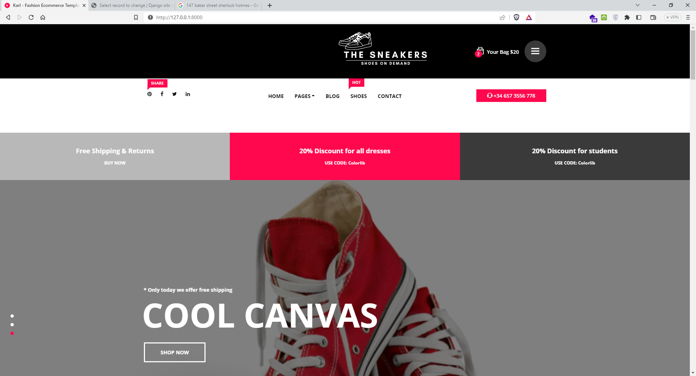
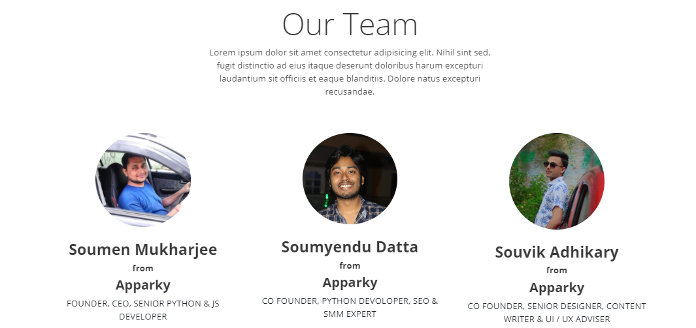

# E-Commerce Site of Shoes With Django-PYTHON by APPARKY

> This is an E-Commerce Site developed with Django-PYTHON. 
> In this project we deal with developing a Virtual website ‘E-commerce Website only for varieties of shoes’. 
> It provides the user with a list of the various shoes available for purchase in the store. 
> For the convenience of online shopping, a shopping cart is provided to the user. 
> After the selection of the shoes, it is sent for the order confirmation process. 
> The system is implemented using Python’s web framework Django. 
> 
> Knowledge of Python and basics of Django Framework is required to build this project.
> 
> 
> # Step-by-Step Guidance:
> 
> ## Step 1:
> 
> 
> - Create Project: Open the IDE and create a project by selecting File -> New Project.
> -  Install django: Next, we will install the django module from the terminal. We have used PyCharm integrated terminal to do this project. 
> You can install django by the following command in the terminal : 
> 
 ```commandline
python -m pip install django command

```
> - You can check the installed django version by running the following command in the terminal : 
> 
```commandline
python -m django -version command as shown below.
```
> - Create django Project: When we execute `django-admin startproject` command, 
> then it will create a Django project inside the normal project which we already have created here. 
> 
```commandline
django-admin startproject MyECOM.
```
> - Run Default Django webserver:- Django internally provides a default webserver where we can launch our applications. 
> python manage.py runserver command in terminal. By default, the server runs on port 8000. 
> Access the webserver at the highlighted URL.
> 
> [http://localhost:8000/](http://localhost:8000/)
> 
> 
> 
> This is how it looks like...
> 
> 
> 
> 
> In this project we have used [Bootstrap](https://getbootstrap.com/) Templates to enhance the User Experience.
> 
> We have agreed the terms and conditions of [Bootstrap](https://getbootstrap.com/) and have used free [Bootstrap](https://getbootstrap.com/) Templates in our work.
> 
> &nbsp; &nbsp; &nbsp; &nbsp; &nbsp; &nbsp; &nbsp; Bootstrap is a free, open source front-end development framework for the creation of websites and web apps. 
> Designed to enable responsive development of mobile-first websites, Bootstrap provides a collection of syntax for template designs.
> 
> 
> Before starting the Project Create a virtual space to run you project and active it by using this command
> 
```commandline
.\venv\Scripts\activate
```
> 
> We also share `requirement.txt` with this project repo. You can install all dependencies from it like this.
```commandline
pip install -r requirement.txt
```
> 
> 
> 
> Now let's create an application and connect it with our main project
>
```commandline
python manage.py startproject myshop
```
> 
> Create `urls.py` on application directory
> 
> Now go to `MyECOM/urls.py` and connect the application with the project file
> Code are given billow
> 
 ```commandline
from django.contrib import admin
from django.urls import path, include

urlpatterns = [
    path('admin/', admin.site.urls),
    path('', include('myshop.urls')),
    
]
```
> 
> 
> 
> 
> 
> 
> 
>
> 
> 
> 
> 
> 
> 
> Meet Our Team Behind this Project 
> 
> [](https://apparky.vercel.app/)
> 
-------------------
> 
> To get more interesting projects follow our GitHub page at [Here](https://github.com/Apparky)
> 
> To get more interesting projects follow our Bitbucket page at [Here](https://apparky.vercel.app/)
> 
> To know more about [__APPARKY__](https://apparky.vercel.app/) Click [Here](https://apparky.vercel.app/)


